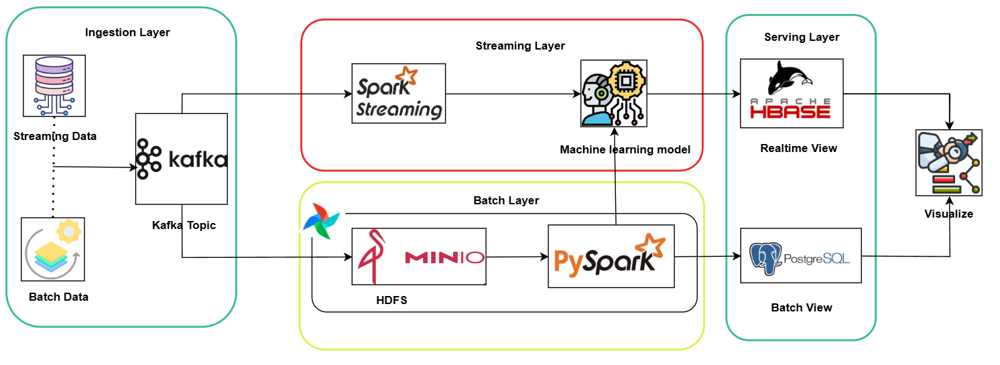

# BigData-20251: Flight Delay Prediction System

This project represents our collaborative work on Big Data, focusing on building a scalable **Lambda Architecture** for processing flight sensor data. The system handles both real-time data ingestion and historical batch processing to predict flight delays and generate operational KPIs.



## Project Overview

The system is designed to simulate a real-world Big Data environment where flight data is continuously streamed, stored, and analyzed.

- **Real-time Layer (Speed Layer):** Ingests streaming data from simulated sensors via Kafka, storing it immediately into HDFS (Parquet format) for historical archiving.
- **Batch Layer:** Processes historical data stored in HDFS using Apache Spark to clean, aggregate, and calculate KPIs (Key Performance Indicators).
- **Serving Layer:** Stores aggregated results in **(PostgreSQL)** and **HBase** for visualization and reporting dashboards.

## Requirements for streaming layer

**Python version:** 3.10 \
**Libraries:**
```
pyspark==3.5.1
plotly
matplotlib
scikit-learn
numpy
pandas
pyarrow
confluent-kafka
happybase
xgboost
seaborn
dotenv
```