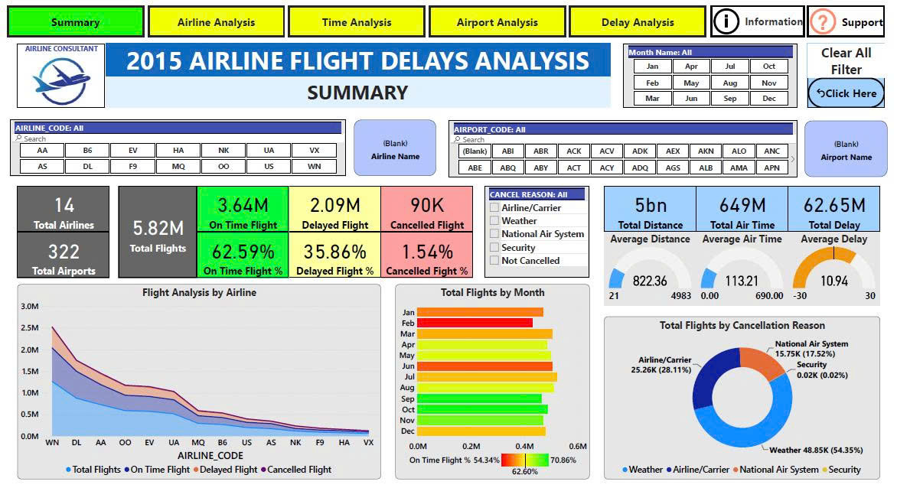

# 1. Header / Navigation Bar (Done ✅)

- Logo + Tên Dashboard
- Thanh menu Tab: “Summary”, “Airline Analysis”, “Time Analysis”, “Airport Analysis”, “Delay Analysis”

# 2. Filter Section (Bộ lọc trên cùng)

Dropdown hoặc multiselect cho:
- Airline Code
- Airport Code
- Month Name
- Cancel Reason
- Airline Name, Airport Name
- Nút “Clear All Filter”

